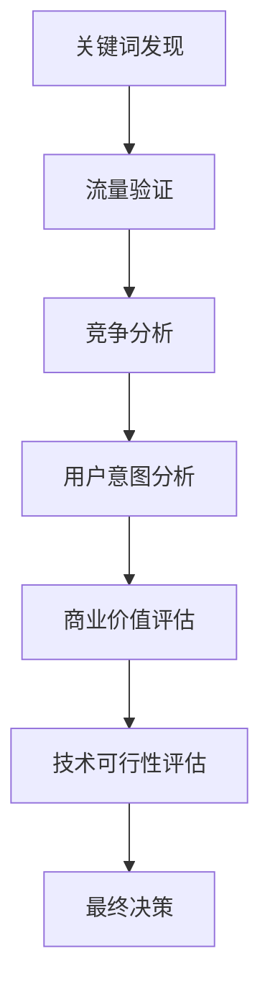

# 海外工具站需求挖掘完整指南

## 目录
- [1. 海外工具站发展前景](#1-海外工具站发展前景)
- [2. 需求挖掘方法论](#2-需求挖掘方法论)
- [3. 核心分析工具详解](#3-核心分析工具详解)
- [4. 实战案例分析](#4-实战案例分析)
- [5. 工具站制作指南](#5-工具站制作指南)
- [6. 商业模式与变现策略](#6-商业模式与变现策略)
- [7. 风险评估与注意事项](#7-风险评估与注意事项)

---

## 1. 海外工具站发展前景

### 1.1 长期价值优势
- **持续收益性**：优质工具站可提供10-20年稳定收入
- **复利效应**：网站存活越久，外链积累越多，排名越稳固
- **被动收入**：一次开发，长期受益的商业模式

### 1.2 当前市场机遇
- **AI热潮**：2024年AI相关工具用户接受度高，传播效果好
- **入场时机**：现在是最佳下场时期，竞争相对较小
- **多元化需求**：短期需求、长期需求、娱乐需求、工作需求并存

### 1.3 发展策略建议
1. **新手路径**：先做短期/娱乐需求练手
2. **进阶布局**：转向长期/工作需求的工具开发
3. **差异化竞争**：在功能、UI、性能等方面超越竞品

---

## 2. 需求挖掘方法论

### 2.1 核心原则
- **数据驱动**：基于真实搜索数据和流量数据
- **多维验证**：使用多个工具交叉验证需求真实性
- **竞争分析**：评估市场竞争激烈程度
- **用户价值**：确保工具能真正解决用户问题

### 2.2 挖掘流程


### 2.3 评估标准
| 维度 | 优秀 | 良好 | 一般 | 较差 |
|------|------|------|------|------|
| 搜索量 | >10K/月 | 1K-10K/月 | 100-1K/月 | <100/月 |
| 竞争难度(KD) | 0-30 | 31-50 | 51-70 | 71-100 |
| 外链需求 | <50 | 50-100 | 101-200 | >200 |
| 商业价值 | 高付费意愿 | 中等付费意愿 | 广告变现 | 变现困难 |

---

## 3. 核心分析工具详解

### 3.1 Similarweb - 流量分析神器

**网址：** https://www.similarweb.com/zh/  
**插件：** https://chrome.google.com/webstore/detail/similarweb-traffic-rank-w/hoklmmgfnpapgjgcpechhaamimifchmp

#### 详细操作步骤：

**步骤1：基础流量查询**
1. 打开Similarweb网站
2. 在搜索框输入目标域名（如：ilovepdf.com）
3. 点击搜索，查看流量概览

**步骤2：流量数据解读**
```
流量单位说明：
- K = 千（1,000）
- M = 百万（1,000,000）
- 例：8.8M = 880万访问量
```

**关键指标分析：**
- **总访问量**：月度访问用户数
- **跳出率**：<30% 表示用户体验良好
- **页面访问数**：>2 说明用户粘性强
- **访问时长**：>2分钟 表示内容有价值

**步骤3：流量来源分析**
1. 点击"流量来源"标签
2. 查看各渠道占比：
   - **搜索引擎**：60-80% 为理想SEO效果
   - **直接访问**：>20% 说明品牌认知度高
   - **社交媒体**：了解社交传播效果
   - **邮件营销**：查看邮件推广效果

**步骤4：地域分布查看**
1. 滚动到"地理分布"部分
2. 分析主要流量来源国家
3. 识别空白市场机会

**步骤5：竞品发现**
1. 查看"相似网站"部分
2. 点击每个竞品查看详细数据
3. 建立竞品分析表格

**实用技巧：**
- 安装浏览器插件，随时查看网站流量
- 建立Excel表格记录竞品数据
- 定期监控竞品流量变化

### 3.2 Semrush - SEO深度分析

**网址：** https://zh.semrush.com/projects/

#### 详细操作步骤：

**步骤1：域名概览分析**
1. 注册Semrush账号（免费版即可）
2. 在搜索框输入目标域名
3. 点击搜索查看概览数据

**关键数据解读：**
- **自然搜索流量**：来自Google等搜索引擎的月度流量
- **付费搜索流量**：广告带来的流量
- **反链数量**：指向该网站的外部链接数
- **引用域名**：链接到该网站的不同域名数量

**步骤2：关键词深度挖掘**
1. 点击自然搜索流量数字（如114.3M）
2. 进入关键词详情页面
3. 查看完整关键词列表

**关键词分析要点：**
```
KD值（关键词难度）解读：
- 0-14：非常容易
- 15-29：容易  
- 30-49：可能
- 50-69：困难
- 70-84：非常困难
- 85-100：几乎不可能
```

**步骤3：使用Keyword Magic Tool**
1. 点击左侧菜单"Keyword Magic Tool"
2. 输入种子关键词（如：cat, dog, coloring）
3. 设置筛选条件：
   - **KD值**：选择0-29（低竞争）
   - **搜索量**：最小100/月
   - **排除词汇**：添加不相关词汇

**步骤4：关键词机会识别**
```
优质关键词特征：
✅ KD值 < 30
✅ 搜索量 > 500/月
✅ 搜索结果多为内页
✅ 非品牌词
✅ 商业意图明确
```

**步骤5：竞品关键词分析**
1. 输入竞品域名
2. 查看"Top Organic Keywords"
3. 筛选你可以竞争的词汇
4. 分析竞品内容策略

**实操技巧：**
- 每天免费查询有限制，合理安排使用
- 导出关键词数据到Excel进行二次分析
- 关注"Questions"类型关键词，用户意图更明确
- 使用"Related Keywords"发现更多机会

### 3.3 Google Trends - 趋势判断

**网址：** https://trends.google.com/trends/

#### 详细操作步骤：

**步骤1：单个关键词趋势分析**
1. 打开Google Trends
2. 在搜索框输入关键词（如：poxer）
3. 设置参数：
   - **地区**：选择目标市场（如美国）
   - **时间范围**：过去12个月或5年
   - **类别**：所有类别或特定分类
   - **搜索类型**：网页搜索

**步骤2：多关键词对比**
1. 点击"+ 比较"按钮
2. 添加对比关键词（最多5个）
3. 分析相对搜索热度

**趋势分析标准：**
```
理想趋势特征：
✅ 稳定或上升趋势
✅ 搜索热度 > 25（相对值）
✅ 无明显季节性波动
✅ 近期无大幅下降

避免的趋势：
❌ 持续下降趋势
❌ 纯季节性需求（如母亲节）
❌ 搜索热度 < 10
❌ 波动过于剧烈
```

**步骤3：地域分布分析**
1. 滚动到"按地区划分的兴趣"
2. 查看全球热度分布
3. 识别潜在市场机会

**步骤4：相关查询发现**
1. 查看"相关查询"部分
2. 分析"热门"和"飙升"查询
3. 发现新的关键词机会

**实用技巧：**
- 使用通配符（*）查看词汇变体
- 对比英文和其他语言版本
- 关注突发事件带来的搜索峰值
- 结合YouTube搜索趋势分析视频需求

### 3.4 Ahrefs - 竞争难度验证

**免费工具网址：** https://ahrefs.com/keyword-difficulty

#### 详细操作步骤：

**步骤1：关键词难度查询**
1. 打开Ahrefs关键词难度工具
2. 输入目标关键词
3. 选择目标国家（默认美国）
4. 点击"Check"按钮

**步骤2：结果数据解读**
```
关键指标说明：
- KD值：0-100的难度评分
- 外链需求：预估需要多少个外链域名
- 搜索量：月度搜索次数
- CPC：每次点击成本（广告价值参考）
```

**难度评估标准：**
```
KD值判断：
- 0-10：超级容易（新站可尝试）
- 11-30：容易（有一定内容基础可做）
- 31-70：中等（需要较强SEO能力）
- 71-100：困难（需要大量资源投入）

外链需求评估：
- <50个域名：个人站长可操作
- 50-100个：需要一定SEO预算
- 100-500个：需要专业SEO团队
- >500个：建议避开或长期规划
```

**步骤3：SERP结果分析**
1. 查看搜索结果前10名
2. 分析竞争对手类型：
   - **域名首页**：竞争最激烈
   - **子域名**：中等竞争
   - **内页**：竞争相对较小

**步骤4：机会识别**
```
理想机会特征：
✅ KD < 30
✅ 外链需求 < 100
✅ 前10结果多为内页
✅ 竞争对手内容质量一般
✅ 搜索量 > 500/月
```

**高级分析技巧：**
1. **批量查询**：使用付费版本批量分析关键词
2. **竞品分析**：查看竞争对手的关键词策略
3. **内容差距**：识别竞品内容的薄弱环节
4. **外链机会**：分析竞品的外链来源

**实操建议：**
- 免费版每天有查询限制，合理规划使用
- 结合Semrush数据交叉验证
- 重点关注KD与外链需求的匹配度
- 定期监控目标关键词的竞争变化

---

## 4. 实战案例分析

### 4.1 完整操作流程示例

#### 从零开始的需求挖掘实战

**场景设定：** 寻找AI工具相关的低竞争关键词

**第一步：初始关键词收集**
1. 在Google搜索"AI tools"、"online tools"等
2. 记录前10名网站域名
3. 使用Similarweb查看这些网站流量

**第二步：Semrush深度挖掘**
```
操作流程：
1. 输入 ilovepdf.com 到Semrush
2. 点击自然搜索流量数字
3. 筛选条件设置：
   - KD: 0-29
   - 搜索量: >100
   - 排除品牌词
4. 导出关键词列表到Excel
```

**第三步：Google Trends验证**
```
验证步骤：
1. 选择5-10个候选关键词
2. 逐个输入Google Trends
3. 查看12个月趋势
4. 筛选出稳定/上升趋势的词
```

**第四步：Ahrefs最终验证**
```
验证标准：
1. KD值 < 30 ✓
2. 外链需求 < 100 ✓  
3. 搜索结果多为内页 ✓
4. 有商业价值 ✓
```

**第五步：竞争对手分析**
1. 分析前10名网站的内容质量
2. 识别内容缺口和改进机会
3. 评估自己的竞争优势

### 4.2 成功案例：Cat Coloring Pages
=======

**发现过程：**
1. **关键词挖掘**：通过Semrush发现"cat coloring pages"
2. **竞争分析**：KD值27，搜索结果前6都是内页
3. **需求验证**：Ahrefs显示难度9，仅需10个外链

**执行策略：**
```
域名选择：ai-coloring-pages.com
- 包含目标关键词
- 融入AI元素提升传播性
- 易记忆，符合用户习惯
```

**产品设计：**
- **核心功能**：AI生成着色图片
- **用户体验**：分类浏览、一键下载
- **内容策略**：用户生成内容(UGC)模式
- **SEO优化**：图片alt标签优化

### 4.2 扩展思路
**相关需求挖掘：**
- dog coloring pages
- flower coloring pages  
- cartoon coloring pages
- holiday coloring pages

**关键词组合策略：**
```
[动物/物品] + coloring pages
[节日/主题] + coloring pages  
AI + [类别] + generator
```

---

## 5. 工具站制作指南

### 5.1 技术选型建议

**前端技术栈：**
```javascript
// 简单项目
HTML + CSS + JavaScript + jQuery

// 中等复杂度
Vue.js / React + UI框架

// 复杂项目
Next.js / Nuxt.js 全栈框架
```

**后端选择：**
- **Node.js**：JavaScript全栈，学习成本低
- **Python**：AI集成友好，库丰富
- **PHP**：部署简单，成本低

### 5.2 学习资源推荐

**基础教程：**
- [HTML教程](https://www.runoob.com/html/html-tutorial.html)
- [CSS教程](https://www.runoob.com/css/css-tutorial.html)  
- [JavaScript教程](https://www.runoob.com/js/js-tutorial.html)
- [视频课程](https://www.bilibili.com/video/BV1Wr4y1R7Bd/)

**快速部署方案：**
1. **GitHub开源项目**：直接fork修改
2. **Vercel模板**：一键部署，快速上线
3. **CodeCanyon付费源码**：功能完整，几十美元

### 5.3 开发最佳实践

**SEO优化：**
```html
<!-- 图片SEO优化 -->


<!-- 结构化数据 -->
<script type="application/ld+json">
{
  "@context": "https://schema.org",
  "@type": "CreativeWork",
  "name": "Cat Coloring Pages",
  "description": "Free printable cat coloring pages for kids"
}
</script>
```

**性能优化：**
- 图片压缩和懒加载
- CDN加速
- 缓存策略
- 移动端适配

---

## 6. 商业模式与变现策略

### 6.1 多元化变现模式

**广告变现：**
- Google AdSense（门槛低）
- 直接广告合作（收益高）
- 联盟营销推广

**订阅服务：**
```
免费用户：每日3次下载
注册用户：每日10次下载  
付费用户：无限下载 + 批量导出 + 高清图片
```

**增值服务：**
- 定制图片生成
- 批量PDF合并
- 商用授权许可
- API接口服务

### 6.2 用户增长策略

**内容营销：**
- 定期发布新图片
- 节日主题活动
- 用户作品展示

**社交传播：**
- Pinterest图片分享
- Instagram话题标签
- Facebook群组推广

**SEO策略：**
- 长尾关键词布局
- 内链优化
- 外链建设

---

## 7. 风险评估与注意事项

### 7.1 常见风险

**技术风险：**
- 开发周期预估不足
- 技术债务积累
- 安全漏洞风险

**市场风险：**
- 竞争加剧
- 需求变化
- 政策法规影响

**运营风险：**
- 内容版权问题
- 用户数据安全
- 服务器稳定性

### 7.2 风险控制措施

**技术层面：**
- 选择成熟技术栈
- 代码质量控制
- 定期安全审计

**商业层面：**
- 多元化收入来源
- 用户反馈收集
- 竞品持续监控

**法律层面：**
- 版权合规检查
- 隐私政策完善
- 服务条款明确

---

## 8. 总结与行动建议

### 8.1 成功要素
1. **数据驱动决策**：基于真实数据而非主观判断
2. **用户价值优先**：解决真实问题，提供优质体验
3. **持续优化迭代**：根据用户反馈不断改进
4. **多渠道获客**：不依赖单一流量来源

### 8.2 行动清单
- [ ] 掌握核心分析工具使用方法
- [ ] 建立关键词挖掘和验证流程  
- [ ] 选择合适的技术栈和开发方案
- [ ] 制定详细的产品开发计划
- [ ] 设计多元化的变现策略
- [ ] 建立风险监控和应对机制

### 8.3 长期规划
**第一阶段（1-3个月）**：选择低竞争需求，快速验证
**第二阶段（3-6个月）**：优化产品体验，建立用户基础  
**第三阶段（6-12个月）**：扩展功能，多元化变现
**第四阶段（12个月+）**：品牌建设，规模化发展

---

*本指南基于实战经验总结，建议结合具体项目情况灵活应用。*