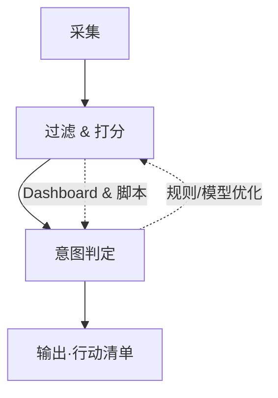
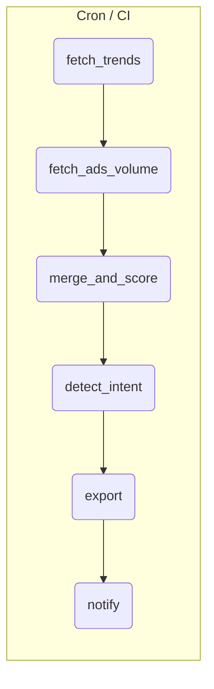

# 关键词挖掘 + 搜索意图分析操作手册

> 目的：用 **90 min/天** 即可完成「高潜关键词发现 → 打分排序 → 搜索意图判定 → 行动清单输出」，并提供半自动化脚本思路与运维节奏。

---

## 目录

0. [目标与鸟瞰](#0-目标与鸟瞰)
1. [操作流程18步](#1-操作流程18步)
2. [搜索意图判定](#2-搜索意图判定)
3. [半自动化实现蓝图](#3-半自动化实现蓝图)
4. [关键词 & 意图 & 行动映射](#4-关键词--意图--行动映射)
5. [交付物 & 维护节奏](#5-交付物--维护节奏)
6. [附录：90min时间框架 & 关键脚本](#6-附录：90min时间框架--关键脚本)

---

## 0. 目标与鸟瞰

### 0.1 核心目标

1. 每日 / 每周批量获取高潜力关键词
2. 自动过滤、综合打分并判定搜索意图
3. 输出可直接执行的内容 / 产品 / 营销动作清单

### 0.2 流程鸟瞰



- **输入**：种子词、品牌词、竞品词
- **中间件**：Google Trends / Ads / Ahrefs / SerpAPI / 自研规则引擎
- **输出字段**：`keyword | volume | growth | KD | score | intent | next_action`

---

## 1. 操作流程18步

### A. 核心挖词  

**1 Google Trends（Rising Queries 导出） | 5 min**  
- 入口：trends.google.com → Explore  
- 设定：国家/地区＝目标市场；时间范围＝过去 30/90 天  
- 操作：输入 1–3 个种子词 → 下拉选 “Rising” → 右上角「Export CSV」  
- 产出字段：`query / value / %growth`  
- 小技巧：用 `pytrends` 批量调用 `related_queries()` 把 Rising 与 Top 同时抓回  

**2 Keyword Planner（搜索量 / 竞争度） | 5 min**  
- Google Ads 后台 → 工具与设置 → 关键词规划师  
- 选择「获取搜索量和预测」→ 粘贴 Step 1 的关键词  
- 导出 CSV：`keyword / avg_monthly_searches / competition`  
- 过滤：月搜 < 300 或 竞争度＝High 暂时剔除  

**3 Ahrefs / Semrush（KD、CPC） | 5 min**  
- 批量导入 Step 2 关键词 → 获取字段 KD、CPC、Global Volume  
- 导出并与 Step 2 通过 VLOOKUP 合并  
- 建议阈值：KD ≤ 20；CPC ≥ 1 USD 标星  

**4 AnswerThePublic（问句、话题） | 5 min**  
- 输入主词 → 选择语言/市场 → 生成可视化  
- Download CSV → 重点保留 Questions / Comparisons  
- 正则去噪：删掉 “in / near / to” 等停用词  
- 输出长尾问句列表供内容团队选题  

**5 Reddit 痛点确认（高赞帖） | 5 min**  
- Google 搜索：`site:reddit.com "关键词"` → 时间筛选 Past Year  
- 记录：Subreddit、帖子标题、Upvotes、Top Comment 摘要  
- 抽取痛点句式（I hate / any tool for / how do you …）写入 `pain_points.md`  

**6 Twitter/X 热度扫描（近 24h/7d） | 5 min**  
- X 搜索 → 高级搜索设定日期（24h/7d）  
- 记录点赞 ≥ 50 的推文文本＋链接  
- 如有 Tweepy：`tweet_count_recent = client.get_recent_tweets_count()` 量化热度  

**7 竞争产品速查（H1 / Feature 列表） | 3 min**  
- Google “关键词 + tool/software” → 打开前 5 个结果  
- 抓 H1、功能清单、价格 → 填表 `competitor_scan.xlsx`  
- 快速标注：未覆盖的功能＝潜在差异化  

**8 快速评分：Volume / Growth / KD 归一化 | 2 min**  
- 将 Volume、Growth%、KD 0–100 线性归一  
- 公式示例：`score = 0.4*V + 0.4*G + 0.2*(100-KD)`  
- `score ≥ 70` → 标记 “进阶分析”  

---

### B. 进阶洞察  

**9★ SERP 结构深扫：PAA / 视频 / Snippet / Ads 数 | 8 min**  
- 无痕窗口 Google 搜索 Top 20 关键词  
- 记录：Ads 数、PAA 是否出现、视频/图片/地图卡片、是否有 Featured Snippet  
- SerpAPI 可自动返回 `ads`, `inline_videos`, `featured_snippet`  

**10★ 内容缺口 & 差异化角度定位 | 6 min**  
- Ahrefs Content Gap：我域名 vs 前 3 竞争域名  
- 把缺失关键词 + 未覆盖子话题列入 `gap_list`  
- 写一句差异化主张（如互动工具/最新数据）填 `angle` 列  

**11★ 付费意图采样：广告着陆页 & 市场价 | 5 min**  
- 查看 SERP Ads → 点进前 3 个 LP  
- 记录：最低价、免费试用天数、主要 USP  
- CPC ≥ 2 USD 且 Ads ≥ 3 → 意图标 “E” (Transactional)  

**12★ Backlink 难度 & 外链机会 | 6 min**  
- Ahrefs SERP Checker：抓前 10 结果 Ref-Domains 中位数  
- 中位数 < 50 ＝ 易竞争；> 200 需外链预算  
- 观察竞争页 Referring Pages：找 guest-post / listicle 机会  

**13★ 社群监听列队（TweetDeck / Google Alert） | 5 min**  
- TweetDeck：新建关键词列，通知频率 1h  
- Google Alert：频率＝“每天”，结果＝“仅最佳”  
- Discord/Slack Webhook 将热门帖推送 #insight  

**14★ 微型问卷 / Discord 投票验证 | 5 min**  
- Typeform 三问：痛点 / 预算 / 现用方案  
- 发 Reddit / Discord；样本 ≥ 30 即统计  
- 痛点评分 ≥ 4/5 → 进入 MVP 待办  

**15★ 1-min Landing Page 草稿（Notion / Carrd） | 5 min**  
- 模板：标题 + 3 痛点 bullet + CTA（留邮箱）  
- 嵌入 Google Form 收集报名  
- 链接贴到 Step 14 帖子末尾，观察转化率  

**16★ 自动化脚本 & Prompt 更新 | 5 min**  
- 将新 Regex/角度写入 `filters.yaml`  
- 更新 `detect_intent()` 关键词词典 & LLM Prompt  
- Git push → GitHub Actions 自动部署 Cron  

---

### C. 复盘  

**17 当日 Top 3 复核 & 备注“Why” | 7 min**  
- `score` 降序取前三 → 人工检查 SERP、生产成本、商业价值  
- 在 `why_ranked` 列写原因（低 KD / 高转化 / 明显缺口）  
- Slack #today-pick 推送并 @内容、产品负责同学  

**18 备份文件 & 明日提醒 | 8 min**  
- 保存 `keywords_YYYY-MM-DD.xlsx` 到云盘 / Git LFS  
- 更新 `log.md`：今日耗时、发现、改进点  
- Zapier 创建 Google Calendar 明日 08:30 任务  
- 邮件 / Telegram 发送「今日总结 + 明日待办」给团队  

---

按照以上拆解执行，即可在 90 分钟内完成从高潜关键词发现到意图判定、行动建议输出的闭环流程。

---

## 2. 搜索意图判定

### 2.1 INCEB 五层框架  


| 层级 | 用户目的 | 关键词信号 | 典型 SERP 元件 | 建议内容/功能形式 | 商业动作 |
|------|----------|-----------|---------------|------------------|---------|
| **I** Informational | 获取信息、背景知识 | what, how, guide, tutorial, idea | PAA、Wiki、知识面板、长篇博客 | ① 入门指南 ② 终极手册 ③ 清单 / 模板下载 | 软植入品牌、收集邮件 |
| **N** Navigational | 直接到达目标站点 | brand, login, dashboard, pricing | Site-links、品牌首页、社媒主页 | ① 站点结构优化 ② 登录 / 定价页加载加速 | 提升品牌信任、减少跳出 |
| **C** Commercial | 比较、评估、意向未定 | best, top, vs, review, pricing, features | 列表文章、横向测评视频、评分聚合 | ① 对比页 ② 案例库 ③ ROI 计算器 | 争取入榜、口碑种草 |
| **E** Transactional | 立即购买 / 下载 | buy, order, coupon, template, download | Shopping Ads、定价页、购物卡片 | ① 促销活动 ② 一键试用 ③ 限时优惠弹窗 | 转化 / 付款 |
| **B** Behavioral | 使用后出现的问题或深度用法 | error, fix, tutorial, integration, API | GitHub Issue、技术论坛、FAQ | ① 故障排查文档 ② 教程视频 ③ 二次销售插件 | 续费、扩容、交叉销售 |

> 小技巧：在数据库中为每层设字段 `intent_level`（I / N / C / E / B）与 `intent_strength`（0–3），方便后续内容排期与广告匹配。  


---

### 2.2 10 步判定流程  

| # | 步骤 | 详细操作 | 产出 & 工具 |
|---|------|----------|-------------|
| **1** | 词面粗分级（动词 + 修饰词） | • 将候选关键词拆分词根 & 修饰词<br>• 用词典匹配 buy / best / guide 等触发词 → 先行标注 I/N/C/E/B 预估 | `tokens.csv`：keyword · verb · modifier · pre_intent |
| **2** | SERP 元件抓取（无痕窗口 / API） | • Chrome 无痕打开搜索 → 截图或 SerpAPI 抓取 JSON<br>• 记录是否出现 Ads / PAA / 视频 / 购物卡等 | `serp_raw.json` |
| **3** | 统计首页 Ads 数量 | • 对 HTML 中 `<span class="ads-ad">` 计数；或 SerpAPI `ads.length`<br>• Ads ≥3 则倾向 C/E | `ads_count` 字段 |
| **4** | PAA 问句文本分析 | • 抽取 People Also Ask 问句 → 用正则获取首词（how / what / why）<br>• how/why 高占比 → Informational | `paa_questions.txt` |
| **5** | Top 10 `<title>` 词频 | • Selenium 拉取前 10 结果 Title<br>• 词云或计数：best / review / pricing 出现次数 | `title_freq.csv` |
| **6** | 用户路径映射至 AIDA 漏斗 | • 将预判意图 I/N/C/E/B 对应到 AIDA（Attention-Interest-Desire-Action）<br>• C 对应 Desire，E 对应 Action | `aida_stage` 列 |
| **7** | Similarweb 停留 / 跳出率参考 | • 查询前 3 竞争域名的 Avg Visit Duration 与 Bounce Rate<br>• 交叉判断：停留>2 min + 低跳出 → 可能是 C/E | `sw_metrics.xlsx` |
| **8** | Reddit & Quora 语境验证 | • site:reddit.com / site:quora.com “关键词”<br>• 抓帖标题及前 5 条评论情绪（VADER ±）<br>• 若多提“推荐 / 体验” → C；“故障 / error” → B | `social_context.md` |
| **9** | 意图标签固化（I/N/C/E/B ± 子标签） | • 综合 1–8 指标 → 规则树或简单逻辑回归<br>• 输出主标签 + 子标签（如 C-Compare, C-Review） | `intent_final` 列 |
| **10** | 输出内容 / 功能建议（见 §4） | • 对 C/E 提示：对比页 / 购买页<br>• 对 I 提示：教程 / 信息图<br>• 对 B 提示：FAQ / 插件介绍<br>• 自动写入 Content Brief 模板 | `content_plan.md` & JIRA Ticket |

> 自动化脚本建议  
> ① 将步骤 2-5 集成到一支 Python CLI：`python intent_checker.py --kw "xxxx"`  
> ② 结果 JSON 经 AWS Lambda 推送 Airtable；Zapier 触发 Notion Page 更新。  

完成以上 10 步即可在 5–8 分钟内为每个关键词输出可追溯、可量化的搜索意图标签，并直接对接内容 / 产品流程。

---

## 3. 半自动化实现蓝图

### 3.1 数据源

- **pytrends**：Google Trends
- **Google Ads API**：搜索量、竞争度
- **Ahrefs / Semrush API**：KD、CPC、Ref Domains
- **SerpAPI / Custom Search**：PAA、Ads、SERP 元件

### 3.2 核心脚本模块

| 函数 | 功能 |
|------|------|
| `fetch_trends()` | 抓 Rising Queries |
| `fetch_ads_volume()` | 拉搜索量 / 竞争度 |
| `merge_and_score()` | 过滤 + 综合评分 |
| `detect_intent()` | SERP→意图（规则或 ML） |
| `export()` | 写 Excel / Google Sheet |
| `notify()` | 邮件 / Slack / Telegram 推送 |

### 3.3 部署方案

- 本地 `cron` / Task Scheduler
- GitHub Actions `schedule`
- AWS / GCP Cloud Functions
- Streamlit / Looker Studio Dashboard（最近 7 天文件自动聚合）

### 3.4 Pipeline 示意



---

## 4. 关键词 & 意图 & 行动映射

| Intent | 推荐内容 / 页面形态 | KPI 指标 | 后续动作 |
|--------|--------------------|----------|---------|
| I | 长篇教程、视频、速查表 | 点击深度、返回率 | 建立 Topic Cluster |
| C | 对比页、评分器、Top 10 列表 | 点击 ↔ Aff Link 转化 | SEM 投放 / 联盟分成 |
| E | Landing Page、购物车、模板下载 | 转化率 / ROAS | Launch 付费广告 |
| B | FAQ、Troubleshooter、插件脚本 | 跳出率、客服工单减少 | 上线支持文档 / 工具 |

> **自动映射**：`next_action = intent.map({...})` → Zapier / Trello 卡片自动创建。

---

## 5. 交付物 & 维护节奏

| 频率 | 交付物 | 负责人 | 说明 |
|------|--------|--------|------|
| 每日 | `keywords_YYYY-MM-DD.xlsx` + Top 10 邮件 | 脚本 → SEO Owner | 人工复核 5 min |
| 每周 | Dashboard 周报（I/C/E/B 占比、Top 30 流量预估） | SEO Owner | 调整阈值 & 规则 |
| 每月 | 准确率抽样 (50 词) + 模型微调 | Data Ops | 目标 ≥ 80 % |
| 季度 | Search Console & GA 结果对账 | Growth Team | 淘汰滞效词、补充新种子 |

---

## 6. 附录：90min时间框架 & 关键脚本

### 6.1 每日 90 min 时间块（示例）

```
08:30–09:00  核心挖词 1–8
09:00–09:45  进阶洞察 9–16
09:45–10:00  复盘 & 备份
```

### 6.2 `detect_intent()` 代码片段

```python
import re, requests, pandas as pd
from serpapi import GoogleSearch

def serpapi_search(q):
    return GoogleSearch({"q": q, "api_key": "YOUR_KEY"}).get_dict()

def detect_intent(keyword):
    data = serpapi_search(keyword)
    ads = len(data.get("ads", []))
    titles = " ".join([o["title"].lower() for o in data["organic_results"][:10]])
    if ads >= 3 or re.search(r"\b(buy|coupon|template)\b", keyword):
        return "E"
    if re.search(r"\b(best|review|vs|alternative|pricing)\b", keyword) or "review" in titles:
        return "C"
    if re.search(r"\b(login|download|official)\b", keyword):
        return "N"
    if "related_questions" in data:
        return "I"
    return "B"
```

### 6.3 GitHub Actions Cron 示例

```yaml
on:
  schedule:
    - cron: "0 6 * * *"
jobs:
  daily-keywords:
    runs-on: ubuntu-latest
    steps:
      - uses: actions/checkout@v4
      - uses: actions/setup-python@v5
        with: { python-version: '3.11' }
      - run: pip install -r requirements.txt
      - run: python pipeline.py
      - uses: actions/upload-artifact@v4
        with: { name: daily-report, path: keywords_*.xlsx }
```

---

### 结语

遵循本手册，你可以把“关键词发现 → 搜索意图解析 → 行动输出”从传统的数小时手工分析压缩到 **5–10 min 的结果复核**，同时确保数据、流程与产出在脚本与 Dashboard 中持续更新。  
如需扩展到 YouTube、TikTok、Bing 等额外渠道，只需在 **采集模块**增加数据源并沿用同一评分 & 意图接口即可。

> Happy Mining & Shipping 🚀